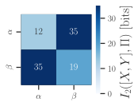

# Limits on Inferring T-cell Specificity from Partial Information

This repository contains the relevant source code for the manuscript "Limits on inferring T cell specificity from partial information"

Allowing for the reproduction of statistical analyses and numerical results reported.

For a number of figures final assembly and cosmetic changes were done in Inkscape as a postprocessing step. In these cases the figures will not be reproduced precisely. To help reuse the final edited figures are provided in png/svg format.

## Installation requirements

The software for these analyses was written in Python and was run on Python 3.10.13. The code relies on [Pyrepseq](https://github.com/andim/pyrepseq) version 1.5. All requirements can be installed by running the following command:

`pip install -r requirements.txt`

## License

The source code is freely available under an MIT license. The plots are licensed under a Creative Commons attributions license (CC-BY).
